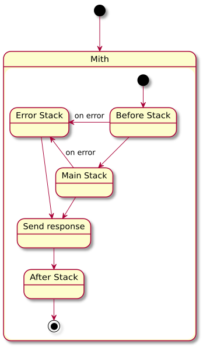

# Mith


[](https://doc.deno.land/https/deno.land/x/mith/mod.ts)

A middleware framework for Deno's http/s server

Highly inspired by the Express middleware system

Differently from Express, the main Mith application is only responsible to handle the middleware system, it has no routes support, and it tries to leave the request and response objects form Deno untouched as much as possible

## Available middlewares

- **[mith_router](https://github.com/JWebCoder/mith_router)** - router middleware
- **cookieSession.ts** - session middleware using cookies
- **[mith_static](https://github.com/JWebCoder/mith_static)** - static file server

**Note:** These middlewares will eventually move to their own repositories to split responsibilities and improve maintenance

[//]: # (For Routing, session, or any other middleware you can check our awesome-mith site of community resources.)

## Usage

**Basic integration**
```typescript
import { Mith, NextFunction, Request, Response } from 'https://deno.land/x/mith@v0.7.0/mod.ts'

const app = new Mith()

app.before(
  async (req: Request, res: Response, next: NextFunction) => {
    res.body.before = true
    next()
  }
)

app.after(
  (req: Request, res: Response, next: NextFunction) => {
    const encoder = new TextEncoder();
    Deno.writeFile('./after.dat', encoder.encode(`${Deno.pid} - ${JSON.stringify(res.body)}\n`), {append: true})
    next()
  }
)

app.use(
  async (req: Request, res: Response, next: NextFunction) => {
    const body = await req.body()
    switch (body.type) {
      case 'error':
        return next(new Error('error'))
      case 'redirect':
        res.redirect('/')
        break
      case 'urlencoded':
      case 'json':
        res.body.test = body.type
        break
      default:
        res.body.test = body
    }

    next()
  }
)

app.error(
  (req: Request, res: Response, next: NextFunction) => {
    res.status = res.error.status || 500
    res.body = res.error.message
    next()
  }
)

export default app
```

Right now I'm still working on the documentation, so you can check the **example** folder for full usage examples

## Multiple stacks



### app.before()

Intended to be used by middleware the enhances the request or response objects. Multipart body parser for example

### app.main()

Main business logic of the application goes here, routing definitions for example
Using `app.use()` will default to the main stack if no stack is passed

### app.error()

This middleware stack will be triggered if the callback function next is called with an error: `next(something)`

### app.after()

This middleware stack runs after sending the response to the user, it's intended to be used with extra integrations that are not directly related to the user response. Analytics or logging for example.
## Middleware parameters

### Request
The request contains information about the request received

#### properties:
- **body()**
Parses the body of the request and returns it in json format
- **query()**
Parses the query string of the request and returns an [URLSearchParams](https://developer.mozilla.org/docs/Web/API/URLSearchParams) object
- **serverRequest**
The original Deno server request

### Response
The response contains information about the response that will be sent back to the requestor.

#### properties:
- **error**
Contains the error sent when calling next(error)
- **body**
The body of the response
- **headers**
A Headers instance which contains the headers for the response
- **finished**
A boolean indicating that the response is completed
- **sent**
A boolean indicating that the response has been already sent to the requestor
- **send**
Sends the response to the requestor
- **redirect**
Redirects the user to another location

### Next
A function that triggers the next middleware in line.

**Triggers the next middleware**
```typescript
next()
```

**Jumps to the error middleware stack**
```typescript
next([someinput])
```

On the error middleware stack calling next([someinput]) has no effect because connection is already on the error stack